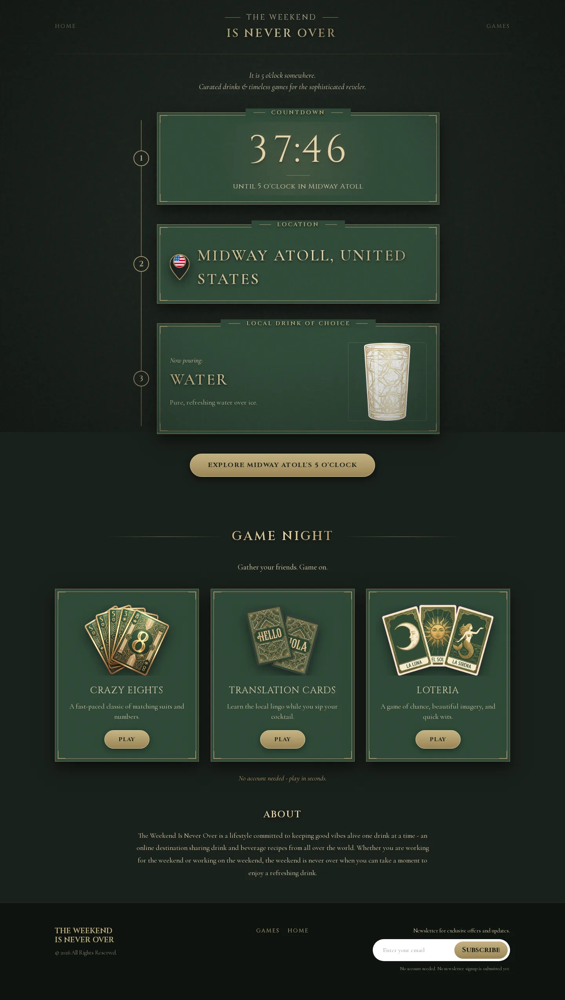
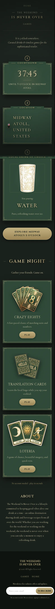

# The Weekend Is Never Over

Twino API is the public homepage for **The Weekend Is Never Over**. The app is a small Next.js site with one art-deco landing page, a live 5 o'clock countdown, drink recommendations, and links into the table games site.

The codebase is intentionally lean. It does not include the old enterprise template, a separate backend server, Jest, or unused API scaffolding.



<p align="center">
  
</p>

## What Runs Here

| Surface                                        | Purpose                                        |
| ---------------------------------------------- | ---------------------------------------------- |
| `/`                                            | Public landing page                            |
| `/privacy`                                     | Privacy Policy                                 |
| `/terms`                                       | Terms & Conditions                             |
| `/robots.txt`                                  | Search crawler policy                          |
| `/sitemap.xml`                                 | Search sitemap                                 |
| `/api/health`                                  | Health check used by uptime/deployment tooling |
| `/health`, `/healthz`, `/api/healthz`, `/ping` | Rewrites to `/api/health`                      |

## Repository Layout

| Path                              | Purpose                                                                |
| --------------------------------- | ---------------------------------------------------------------------- |
| `app/page.tsx`                    | Next.js home route that renders the landing experience                 |
| `app/layout.tsx`                  | Root layout and Google font wiring                                     |
| `app/api/health/route.ts`         | Minimal health endpoint                                                |
| `app/privacy/`, `app/terms/`      | Legal pages                                                            |
| `app/robots.ts`, `app/sitemap.ts` | SEO crawler endpoints                                                  |
| `components/LegalDocument.tsx`    | Shared legal page renderer                                             |
| `components/StructuredData.tsx`   | JSON-LD structured data                                                |
| `components/FiveOclockDeco/`      | Landing page UI components, hooks, data, styles, and Storybook stories |
| `components/Countdown/`           | Time-zone and countdown helpers                                        |
| `public/drinks/`                  | Drink images used by the countdown panels                              |
| `public/flags/`                   | Flag assets keyed by country                                           |
| `public/games/`                   | Game card images linking to table games                                |
| `public/readme/`                  | README screenshots generated from the app                              |
| `tests/e2e/`                      | Playwright smoke tests                                                 |
| `.storybook/`                     | Storybook configuration                                                |

## Component Shape

The landing page is split into small components so the UI can be documented and tested in isolation:

- `FiveOclockDeco.tsx` composes the page and wires focused hooks together.
- `useCountdownLocation.ts`, `useDecoMotion.ts`, `usePointerEffects.ts`, and `useParticles.ts` hold the imperative client behavior.
- `HeroSection.tsx` composes the countdown, location, and drink panels.
- `CountdownPanel.tsx`, `LocationPanel.tsx`, `DrinkPanel.tsx`, and `GameCard.tsx` are presentational components.
- `GameNightSection.tsx`, `AboutSection.tsx`, `Header.tsx`, `Footer.tsx`, and `Atmosphere.tsx` hold page sections.
- `data.ts` maps time zones, drinks, flags, and game card metadata into UI-ready data.
- `validateData.ts` checks that static mappings reference valid entries.

## Styling

`components/FiveOclockDeco/deco.css` is only an import manifest. The actual styles are split by concern:

- `base.css` - tokens, reset, focus, body, and scrollbar styles
- `atmosphere.css` - film grain, vignette, sunburst, particles, and side fans
- `components.css` - typography utilities, buttons, panels, and reveal classes
- `header.css`, `hero.css`, `game-sections.css`, and `footer.css` - page sections
- `motion.css` - reduced-motion fallbacks

## Development

Use pnpm through Corepack:

```bash
corepack pnpm install
corepack pnpm dev
```

Open `http://localhost:65210`.

## Scripts

```bash
corepack pnpm lint
corepack pnpm typecheck
corepack pnpm build
corepack pnpm test:e2e
corepack pnpm storybook
corepack pnpm build-storybook
corepack pnpm format
```

## Testing Strategy

This repo uses Playwright smoke tests instead of Jest because the highest-risk behavior is page rendering and routing, not isolated business logic.

The e2e suite currently verifies:

- The homepage renders the main sections.
- Game cards link to `https://games.theweekendisneverover.com`.
- `/api/health` returns `{ "status": "ok" }`.
- Placeholder `#` links are not present.
- The newsletter signup form is not visible until a real provider and privacy disclosure exist.
- Privacy and Terms routes render and cross-link.
- Robots and sitemap routes are available.
- Production metadata, canonical URL, Open Graph image, and JSON-LD structured data render.
- Static drink, flag, and game asset references resolve to files.
- Desktop and mobile visual smoke screenshots can be captured.

Add unit tests later only if the countdown/time-zone helpers become complex enough to need isolated edge-case coverage.

## Storybook

Storybook uses the Vite-based Next.js framework. The current stories cover the reusable art-deco panels, long-text states, fallback assets, the hero, game night, and footer.

```bash
corepack pnpm storybook
```

Open `http://localhost:6006`.

## Deployment

The site deploys on Vercel from this repository.

The canonical branch is `main`. GitHub and Vercel both use `main` for production.

## Legal And Email

The footer intentionally does not include newsletter signup. Add it only after there is a real email provider, working mailbox routing, and an updated Privacy Policy.

The Privacy and Terms pages list `theweekendisneverover@gmail.com`, which is the current working contact email. Domain-specific aliases such as `privacy@theweekendisneverover.com` or `legal@theweekendisneverover.com` should only be published after mailbox routing is configured and tested.

## Relationship To Table Games

This homepage links to the table games app at:

```text
https://games.theweekendisneverover.com
```

Game links are configured in `components/FiveOclockDeco/data.ts`.
